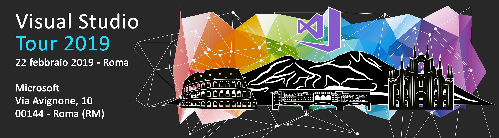

## Materiale sessioni

#### Keynote
<a href="01-KeyNote%2FVisual%20Studio%20Tour%202019%20-%20Rome%20-%20KeyNote.pdf" target="_blank">Slide</a>

---
#### What's new in Visual Studio 2019 
Visual Studio 2019 introduce interessanti miglioramenti e nuove funzionalità volte a ottimizzare la produttività degli sviluppatori e la collaborazione dei team. Sia che si utilizzi Visual Studio per la prima volta o che lo usiamo da anni, è possibile beneficiare di funzionalità che migliorano tutti gli aspetti del ciclo di sviluppo, dalla creazione di progetti più agevole e più mirata alla clonazione dai flussi di lavoro del repository, per incrementare la gestibilità e la qualità del codice.

Speaker: 
- Alessio Iafrate (<a href="https://twitter.com/alessioiafrate" target="_blank">@alessioiafrate</a>) - Microsoft MVP - DotNetAbruzzo
- Angelo Gino Varrati (<a href="https://twitter.com/angelus_gi" target="_blank">@angelus_gi</a>) - Microsoft MVP - DotNetAbruzzo

<a href="https://www.slideshare.net/alessioiafrate96/whats-new-in-visual-studio-2019" target="_blank">Slide</a>

---
#### The evolution of .Net Core 
Ancora un altra versione del .NET Framework? C'era veramente bisogno di un altro framework .NET? Queste sono le domande che spesso circolano riguardo a .NET Core e questa e' la sessione giusta per togliersi i dubbi!! Perche' Microsoft ha investito e sta investendo tanto su .NET Core? Quali sono i vantaggi del nuovo framework? E quale e' la roadmap? In questa sessione cercheremo di capire la filosofia che sta dietro a .NET Core, le sue caratteristiche peculiari e i suoi punti di forza in modo da dare a tutti gli strumenti per valutare l'adozione dello stesso.

Speaker: 
- Massimo Bonanni (<a href="https://twitter.com/massimobonanni" target="_blank">@massimobonanni</a>) - dotNET{{podcast}

<a href="03-The%20evolution%20of%20.Net%20Core%2FThe%20evolution%20of%20.NET%20Core%20-%20Rome.pdf" target="_blank">Slide</a>

---
#### Visual Studio <3 DevOps
Le metodologie DevOps sono sempre più utilizzate e uno strumento come Visual Studio non può essere da meno. Una sessione alla scoperta delle funzionalità di CI\CD di Azure DevOps utilizzate direttamente all'interno di Visual Studio su un progetto pilota.

Speaker: 
- Massimo Bonanni (<a href="https://twitter.com/massimobonanni" target="_blank">@massimobonanni</a>) - dotNET{{podcast}

<a href="04-Visual%20%20Studio%20loves%20DevOps%2FVisual%20Studio%20loves%20DevOps.pdf" target="_blank">Slide</a>

---
#### Code review e pair programming con Visual Studio Live Share
In questa sessione illustreremo cos'è Visual Studio Live Share, quali sono le sue funzionalità e ne mostreremo l'uso in alcuni scenari tipici di grande utilità nella collaborazione con altri sviluppatori collegati in remoto.

Speaker:
- Nicolò Carandini (<a href="https://twitter.com/tpcware" target="_blank">@tpcware</a>) - Microsoft MVP - DomusDotNet
- Giorgio di Nardo (<a href="https://twitter.com/akelitz" target="_blank">@akelitz</a>) - DomusDotNet

<a href="https://www.slideshare.net/NicolCarandini/code-review-e-pair-programming-con-visual-studio-live-share" target="_blank">Slide</a>

---
#### How to create custom modules for Visual Studio

In questa sessione impareremo a creare dei moduli custom aggiuntivi per Visual Studio. In particolare vedremo come creare delle estensioni personalizzate e come creare dei template di progetto da condividere all'interno della nostra Azienda.

Speaker: 
- Luca Congiu (<a href="https://twitter.com/congiuluc" target="_blank">@congiuluc</a>) - DotNetCode.IT

<a href="06-How%20to%20create%20custom%20modules%20for%20Visual%20Studio%2FVisualStudioExtensions.pdf" target="_blank">Slide</a>

---
#### Esploriamo Visual Studio Code 

In questa sessione faremo conoscenza del nuovo, leggero e potente editor e su come sfruttarlo e personalizzarlo al meglio per l'uso quotidiano. Inoltre vedremo con delle demo come utilizzarlo con i linguaggi Javascript, Typescript e .NET.

Speaker:
- Simone Natalini - DotNetCode.IT

<a href="07-Esploriamo%20Visual%20Studio%20Code%2FExploring%20VS%20Code.pdf" target="_blank">Slide</a>

---